Starting last year, I decided to climb a mountain every year on my birthday. To make it a proper challenge, I usually choose something iconic and harder than anything I have climbed before. Last year I completed Mailbox Peak. This year I set my sights on Mount St. Helens.

Mount St. Helens is an active volcano near the Washington–Oregon border. Its enormous 1980 eruption created a giant horseshoe-shaped crater at the summit. Climbers can follow an established route to the crater rim, then continue along the rim to the highest point at 2,550 meters. The full route is 10.7 miles, or 17 kilometers, round trip, with about 4,500 feet, or 1,370 meters, of elevation gain. It typically takes seven to twelve hours. Before leaving, I wondered: could there be any cooler way to celebrate a birthday than climbing this mountain? It turned out there could. The trip became far crazier than I had imagined, crazy enough that I had to write it down.

## Summiting Mount St. Helens

Because the mountain is far from Seattle, I drove to the trailhead the day before and slept in my car. It was not particularly comfortable. I woke before sunrise, but excitement had already chased away all sleepiness. I packed and checked my gear, then wrote my information and estimated return time in the climber's register. It was not yet seven in the morning. After a moment of thought, I put down 3 p.m. and walked into the mountain.

The first section wound through the forest with little elevation gain. On either side stood the tall but slender trees common on hikes in Washington. I barely rested, kept a fast pace, and passed several groups.

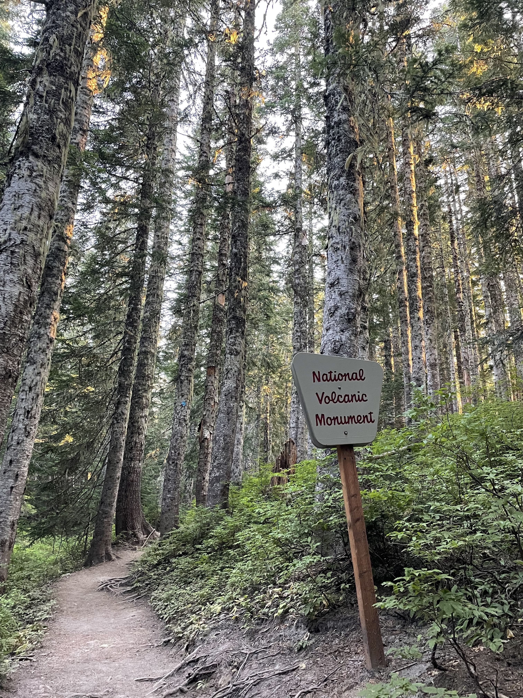

After about 2.5 miles, I entered open terrain and the route began to reveal its difficulty. The mountain became extremely steep, covered entirely in bare rocks and gravel, with nothing growing except a few shrubs. Besides the terrain, route-finding was another major challenge. There was no longer a clearly visible trail like the one in the forest. Instead, upright wooden posts pointed out the direction. At each post, I had to locate the next one and head toward it. Sometimes the posts were far apart, and choosing the route between them was entirely up to me. On steep scree I leaned on my trekking poles. When I encountered large boulders, I put on gloves and climbed. Fortunately, I had done my homework and brought the right equipment. My speed dropped, but I could handle everything.

During a break, a small incident occurred. A white guy passing by asked whether anyone had lost a pair of AirPods. I thought, who in this world could be more likely to lose AirPods than me? I reached into my pocket and, sure enough, they were gone. I immediately said they were mine. I had not listened to music at all and had no idea when I had dropped them. I never imagined anyone would find them. Somehow my AirPods had neither slid down the mountain nor fallen into a crack. Someone behind me had found them and returned them. How miraculous!

    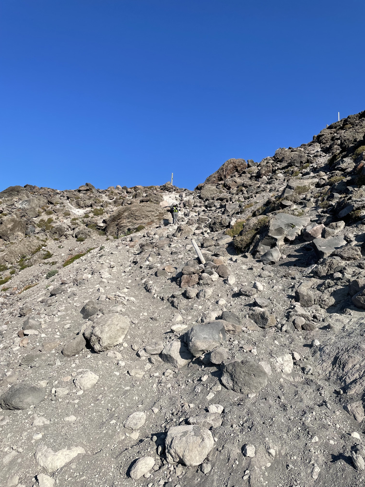

Excited by their return, I continued upward. The large rocks gradually disappeared and I reached the final section, known as the "vertical beach." The crater rim was clearly visible, yet somehow still impossibly far away. The route grew steeper and the wind stronger. The sand and gravel beneath my feet were so loose that every step upward slid half a step back. Gasping and looking at the people struggling in front of and behind me, I suddenly thought of the Journey to the West and the Silk Road. Had they looked something like this? I heard someone call it her "least favorite hike ever," and I could not have agreed more. The difficulty was one thing. The complete absence of scenery made it pure suffering.

    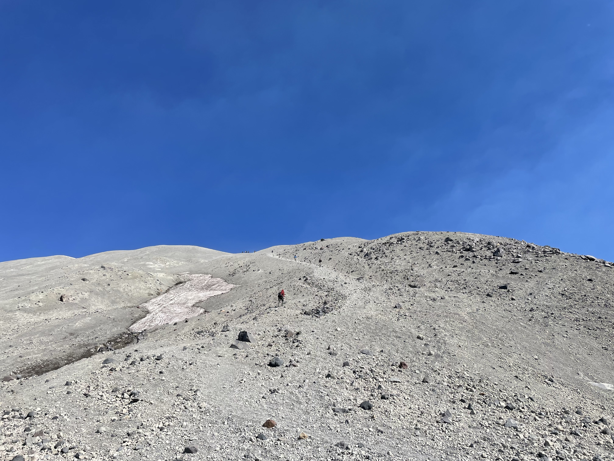

One way or another, I eventually made it. Before me was an enormous and spectacular crater that I find difficult to describe. After the 1980 eruption, President Jimmy Carter visited and said something roughly like, "Some people say this place looks like the surface of the moon. Compared with this, the moon is a golf course." That is about right.

    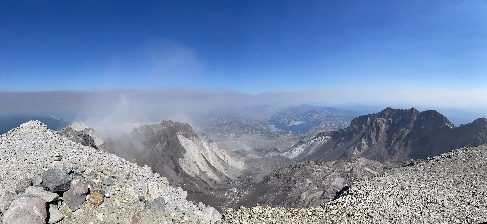

For most people, the climb ended there, but this was not the highest point on Mount St. Helens. Reaching it required another quarter mile west along the rim, climbing up and down beside the crater. I hesitated, then decided to practice that fine Chinese virtue: "We came all this way!" I did not want to leave with regrets. I had to go. The climbing itself was not difficult, V0 at most. But the wind at the summit was ferocious, and a fall into the crater would result in serious injury if not death. It felt a little like free soloing.

During the hour I spent on the crater rim, only three people reached the highest point: one tough American, one tough Indian, and one tough Chinese guy—me. The enthusiastic Indian guy took a photo for me. Mission accomplished. The trip had been worthwhile. He was unbelievably strong and wore only a T-shirt and shorts. I had on a thin insulated jacket bought on sale at REI, whose overly bright color had earned me plenty of mockery from Fengfeng. A windbreaker should have been enough, but this happened to be the easiest jacket I owned to carry. I had no idea that this accidental choice would later save my sorry life.

    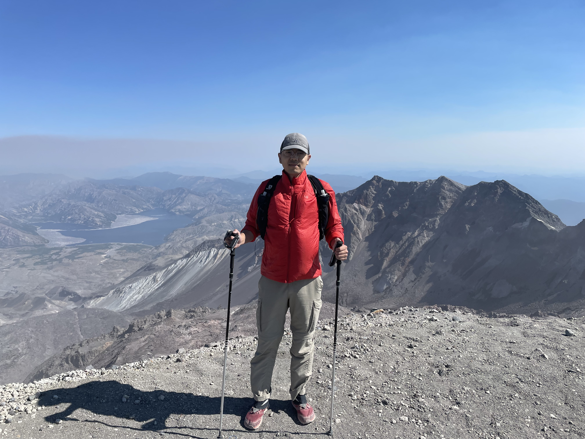

## Precious Footprints

Cyclists have a famous saying: climbing is like eating shit; descending is like diarrhea. It applies equally well to Mount St. Helens. Going down was fast, exhilarating, and a little dangerous. Put a foot down and gravity carried both me and the gravel downhill. It took much less effort than climbing. Having fulfilled another wish, I felt rather pleased with myself and began thinking about what I would eat as a reward after reaching the bottom. But I had twisted an ankle on descents more than once before, so I did not let myself get too carried away. I kept my eyes fixed on the ground to make sure I never stepped into empty space.

The terrain gradually grew rougher and steeper until standing became nearly impossible. I had no choice but to sit down and slide, using my trekking poles as brakes. The sliding sent loose rocks tumbling downward. Worried that I might hit someone, I looked into the distance. There was no one below me. I looked back uphill. No one there either.

I suddenly realized that I had probably left the main route. But I was on a scree slope where moving sideways was unsafe, so I could only keep sliding down. When I finally stopped, I stood and tried to find the correct route. I could see no people, much less the small wooden markers. The entire view contained only yellowish-white rocks and whitish-yellow glaciers. The descent ran north to south, so I had either drifted east or west. Naturally, there was no cell signal. Google Maps could show my GPS location but did not include the trail. I still had no way to decide. All I could do was look east, then west.

    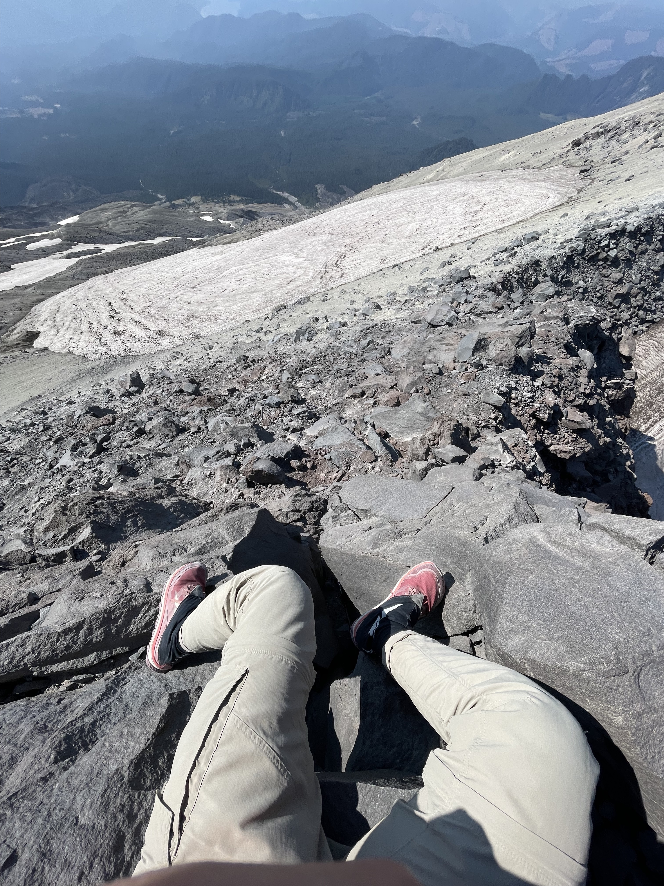

Suddenly, I saw a figure far to the west and hurried toward it. A small glacier lay between us. I had no crampons and crossing it would be difficult, but I could no longer worry about that. My rule was simple: whenever I felt unstable, I dropped onto my butt to lower my center of gravity and avoid injury. After great effort I reached the little ridge to the west, but the figure had disappeared. Was I beginning to see things?

I searched toward the east again. This time I saw a faint trace resembling footprints, and farther away, a dark shape that looked like someone sitting down to rest. I immediately headed east, once again struggling across the glacier and climbing up and down. The trace turned out to be marks left by stones moving in the wind, not footprints at all. The dark figure was simply another strangely shaped rock. I kept looking around and discovered that every distant black dot seemed like a person, and every mark seemed like a footprint, until I looked more carefully and realized none of them were. Anxiety began to rise. I shouted, "Hello! Anybody here!?" No one answered. Only the sun burned overhead while the wind blew sand past my ears.

I calmed myself. I could not keep wandering. I needed to determine the correct direction. My Apple Watch showed that I was around 6,000 feet. The paper map showed a trail circling the mountain at 4,700 feet. No matter which way I had drifted, if I descended to that elevation and found the trail, I would at least reach a safe route and might even return to the trail I had climbed. I decided to focus on moving down—south.

Traveling off-route on a mountain is extremely dangerous. You never know when you will reach a cliff or when the rock beneath your foot will come loose. I stayed intensely alert, searched for the safest possible line, and tested every step before putting my weight on it. Suddenly, I saw a small building with an antenna and solar panels: a weather station. I rushed over. Even more exciting, I found a trail of footprints—human footprints. Someone had been here! To me, those prints were more precious than Armstrong's on the moon. I could follow them down the mountain and finally stop fearing every single step.

    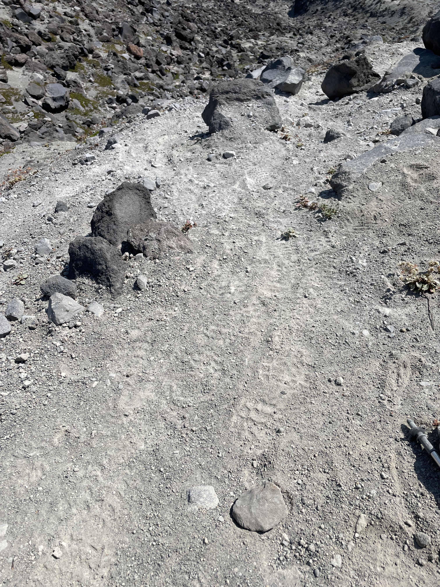

## The Best Water in the World

I followed the footprints down to around 4,700 feet but did not find the expected intersection, so I kept descending. Before long I returned to the forest and found a sign identifying the route below as June Lake Trail. On the map, I saw that this trail was half a mile east of the route I had climbed. Less than two miles south would bring me back to my starting point, while the June Lake trailhead was another three miles downhill.

Now that I roughly knew my position, I faced a difficult choice: return to my original route or continue down this one. Reaching the original route required leaving the trail again and crossing the forest. Reaching the June Lake trailhead meant finding someone there willing to drive me back to my car. This did not seem like a popular trail, and the footprints I had followed might not even have been from that day. What if no one at the trailhead could help? My energy was nearly gone, and I had run out of water long ago. I ultimately decided to cross the forest toward my original route.

According to the map, if I kept moving southwest, I would probably make it back. But traveling through the forest was even harder than the earlier descent because there was no path at all. Trunks, branches, and vines tangled together and blocked the way. Leaves, weeds, and shrubs made the ground impossible to see. I tried not to step into a hole, which left little attention for what was in front of me. I went around large trunks and shoved smaller branches aside. On a normal trail I could cover half a mile in twelve or thirteen minutes. In terrain like this, I had no idea how far I had gone. Occasionally I saw a horizontal white line ahead that looked like a road. I would rush toward it, only to discover a rotting log.

After about half an hour, I discovered something devastating. My watch showed an elevation of 3,700 feet, while the trail I had climbed rose continuously from its starting point at 3,800 feet. I had very likely passed it. Worse, the compass and altimeter readings on my watch and phone disagreed, while my position on the map kept drifting. I had no idea which device to trust. The trees increasingly blocked the sun, making direction harder to judge. I was completely lost.

I began crashing around in confusion. One moment I tried to find the starting point; the next I considered returning to the trail I had left. After only a few minutes I collapsed onto the ground. I was simply too tired. I tried to call 911. No signal. I shouted for help, the call gradually changing from "Hello, I need help!" into a hysterical single word: "HELP!!" Still no one answered.

I forced myself to calm down and think carefully about the situation. It was a little after four in the afternoon. Sunset was at 7:30. I had some energy left but had gone more than two hours without water, and shouting had made me even drier. The most important thing was to find water. Next came finding a route. Getting out came last. I slowly followed the slope downward while listening carefully for running water.

At last, luck was on my side: I found a small stream. There was no longer time to worry about whether the water was clean. I filled my bottle and drank two full bottles in a row. The water had no flavor at all, yet it tasted sweet, refreshing, and a hundred times better than anything I had ever drunk. Afterward, I lay on a rock beside the stream and closed my eyes. Even the mosquitoes buzzing around my ears sounded like a beautiful symphony. Huwan Peng was not going to die here today!

## The Earth as My Bed, the Milky Way as My Blanket

After recovering some energy, I stood and decided simply to follow the stream rather than insist on reaching any particular point. Following the water would keep me moving downhill without drifting sideways, while guaranteeing that I had something to drink. After a while, the GPS signal improved. I could clearly see that I was beside a stream and that following it another 1.2 miles would reach a road. The news revived me again. Human civilization was only 1.2 miles away.

Of course, it was not going to be that easy. The water disappeared, leaving only a dry creek bed. I followed the bed until it ended at a cliff. During the wet season it was probably a waterfall. Now it was a drop seven or eight stories high, with no safe route on either side. After all the setbacks that day, this one barely registered. So what? I would keep looking.

    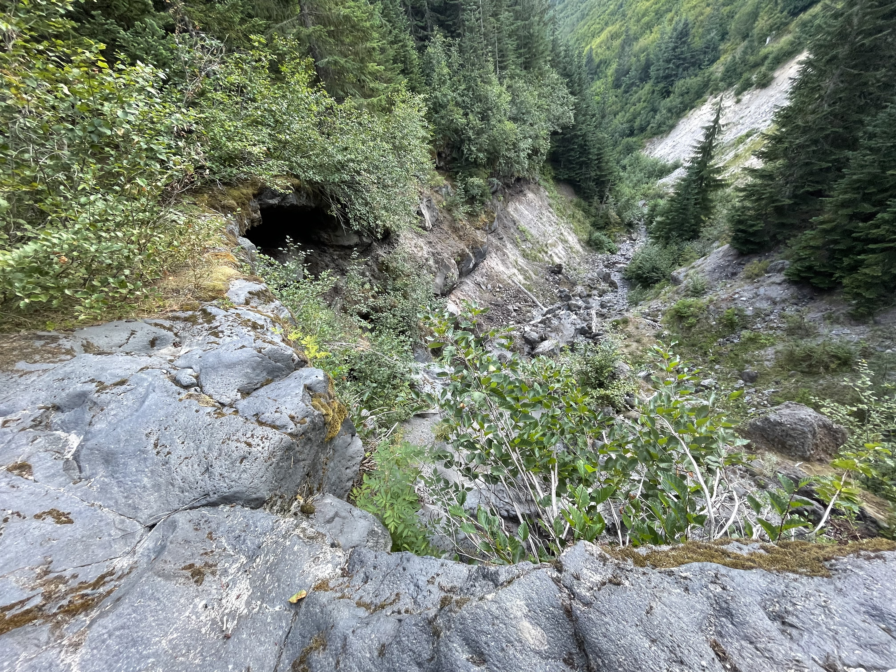

I retraced my steps to the stream and checked Google Maps again. The starting point was somehow only 0.6 miles southwest, but 400 feet above me on a slope. Less than an hour remained before sunset. I had long since exhausted my strength and was moving only by force of will. Whether I headed directly toward the start or searched for another route, I could not guarantee that I would escape before dark. I had to make another crazy decision: spend the night there.

It was crazy, but not reckless. I had checked the weather. The nighttime temperature would remain around five or six degrees Celsius, and the thin insulated jacket should keep me from freezing to death. I still had one protein bar. My first-aid kit contained fever reducers and painkillers. My research had never mentioned large wild animals in the area. I was quite confident that I could survive the night. I found a comfortable position, lay down, stretched the limbs that had worked all day, and gradually relaxed.

    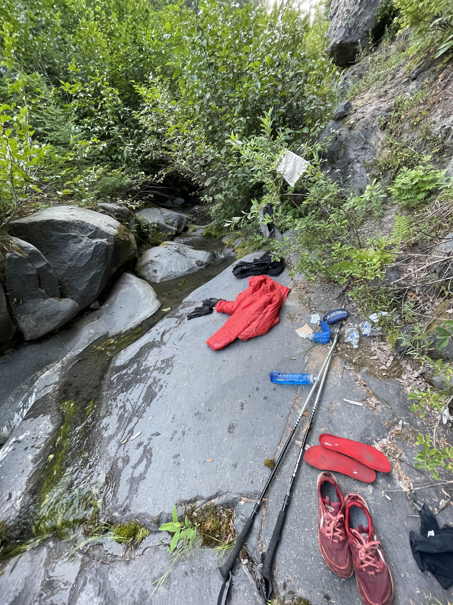

Darkness deepened. The sky filled with unusually clear stars, more than I had ever seen. The endless noise of insects disappeared, leaving only the murmur of the stream. Many people have camped, but probably not many have lain down in the wilderness completely unprepared like this. The earth was my bed, the Milky Way my blanket, and the running water the finest ASMR. All my fear disappeared. I even felt a little comfortable.

After a while, clouds covered the stars and the temperature dropped sharply. I curled up on my side. My upper body was all right, but my feet and legs gradually grew cold. At first my legs only trembled slightly. Soon my entire body was shaking violently like an old tractor. Then my calves, thighs, and butt began taking turns cramping. I had to keep changing positions and stretching the muscles. Fortunately, nothing else felt wrong, and my state of mind remained calm.

Sleeping was clearly impossible. To pass the long night, I began thinking about everything and nothing:

- Finding the AirPods had been far too miraculous. Was I originally supposed to lose the headphones and make it down safely, only for the return of the headphones to require that a person stay behind on the mountain? No, no. If someone could find those tiny AirPods, how could a whole person like me fail to make it out?
- Casey Neistat has a wonderful vlog called *The Day I Almost Died* about a dangerous experience climbing Kilimanjaro. If I got out, I would write something about my own experience too.
- From *Meru* and *Free Solo* to *14 Peaks* and *The Alpinist*, I had recently watched many mountaineering documentaries. Compared with the challenges in those films, my situation was nothing.
- At this point, the only thing that could still trap me here was probably a sudden volcanic eruption. But dying in a volcanic eruption would be incredibly cool. That was a cause of death I could not possibly refuse.
- By American time, I had not yet turned twenty-eight. If I died, I could count as part of the 27 Club. Just like the great Kurt Cobain and Jimi Hendrix, I would add another member to Seattle's 27 Club!
- Of course I did not want to die. I was not especially afraid of death itself. I was more afraid of causing trouble for other people. If I died, my parents would have to travel to the United States. Imagine that mess during the pandemic. I had plans to visit Yellowstone with friends. If I died, they probably would not feel like going anymore. Wouldn't all those hotel and plane reservations go to waste?
- I still had many promises to fulfill, and I did not want to become someone who broke his word. I had not seen my parents in almost four years, and I wanted to take them traveling in the future. I had promised Fengfeng a grand proposal. I had also promised myself that I would go to more places: Rainier, Mount Whitney, the Annapurna Circuit, Machu Picchu, and on and on.
- **Freedom** and **commitment** are the two things I value most. If hiking into the wilderness is the pursuit of freedom, returning safely is keeping a commitment. What a philosopher I was!
- ...

I thought like this until four in the morning, when raindrops suddenly began to fall. How could it be raining? I remembered the forecast saying cloudy. I quickly sat up, hugged my knees, and lowered my head, trying to preserve warmth and keep as dry as possible. By then I had exhausted every resource and had nowhere to hide. All I could do was pray for daylight to come quickly and for the rain not to grow heavier.

## A Long Journey Back

Fortunately, the rain never became heavy. The sky began to brighten around six. I packed immediately and set out for the parking lot where I had started. I checked the map one more time: 0.6 miles southwest, climbing 400 feet. My phone had 10% battery remaining. I had to arrive before it died.

The slope was once again steep, covered in tall and dense conifers. My body had not recovered, but I forced my exhausted legs to carry me upward, pushing and pulling my way through however I could. The rain had made the ground extremely slippery, so I grabbed branches to keep my balance. Every few minutes I became too tired to continue and had to stop, rest, and check my location. I still saw no trace of another person, but the GPS no longer drifted. At least I was now steadily getting closer to the destination.

Finally, after being lost inside Mount St. Helens for eighteen hours, I returned to the starting point and saw another human being again.

    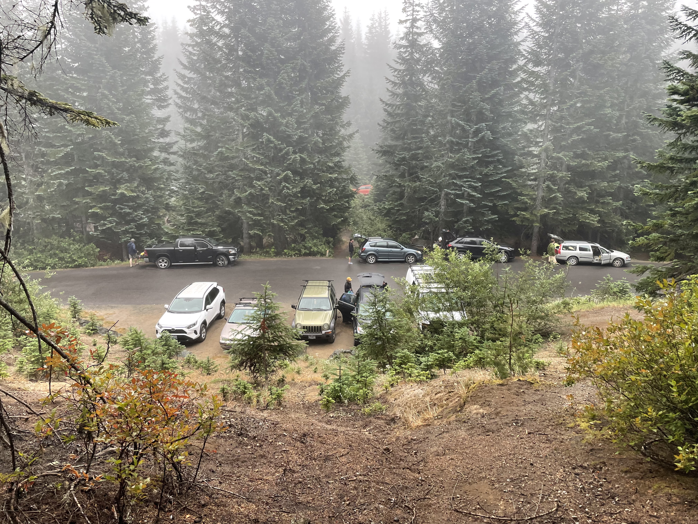

I was so excited that I walked up to the first person I saw and blurted out the sentence I had been holding in all night: "I almost died." Without caring whether she wanted to listen, I poured out the entire story. She was visibly surprised and asked when I had entered the mountain. I said the same time yesterday. "That's a long journey back," she said. Yes. What a long journey. More than twenty-four hours after entering the mountain, Huwan Peng—certified tough guy—had finally returned.

Only after changing clothes in the car did I discover that my body, from arms to feet, was covered in cuts, bruises, and swelling. There was hardly a patch of intact skin. Both soles had blisters, and both big toenails were filled with blood. Yet I felt none of it. When I weighed myself after reaching home, I had lost seven jin—nearly eight pounds—and looked visibly thinner. During those twenty-four hours I had not slept, had eaten only three protein bars, had walked more than fifteen miles, climbed more than 5,000 feet, and spent a night alone deep in the mountains. I had crossed scree, glaciers, forest, shrubs, and streams. Huwan Peng, certified tough guy, was never going to die!

    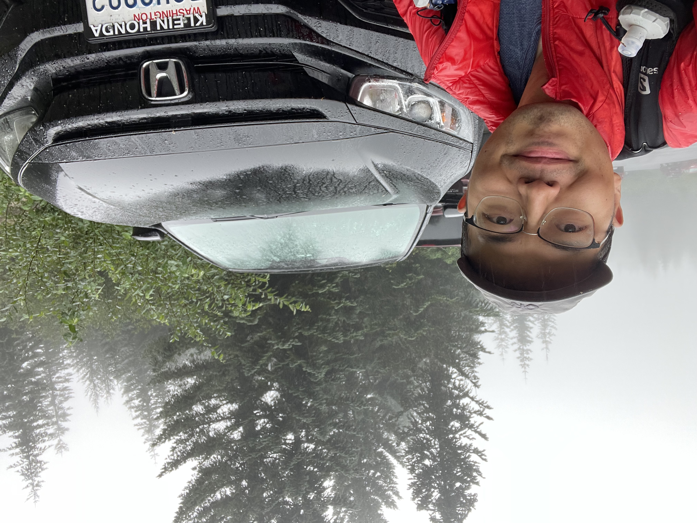

With the air conditioning blowing and music playing, I felt delighted and not sleepy at all. I decided not to rest and drove straight home.

When the car returned to I-5, the shuffle landed on Coldplay's *Fix You*. Something inside me that had been wound tight all night suddenly let go, and I began sobbing uncontrollably.

## Postscript

The story ends here, but I want to add one thing. Mount St. Helens is not an especially difficult route. I ended up in this situation entirely because I was underprepared. A proper GPS track-recording app or device could have prevented all of it. Apple Watch is pure garbage outdoors. At many points I had a substantial chance of being injured. Making it out safely required good luck, along with the rest of my equipment being adequate.

Everyone—and especially I—should remember this: prepare thoroughly every time you go into the outdoors. Always stay on trail, even if you consider yourself a certified tough guy.
