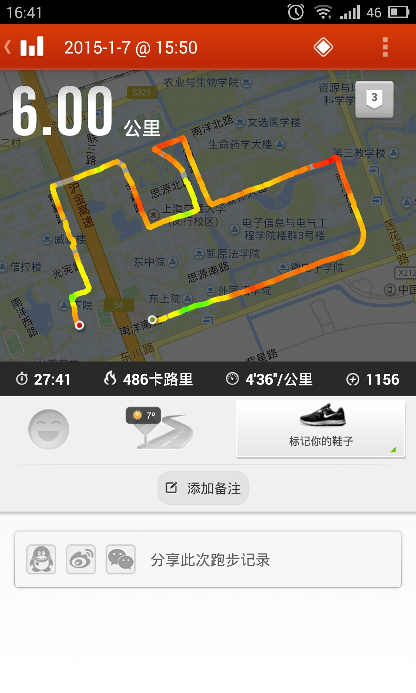
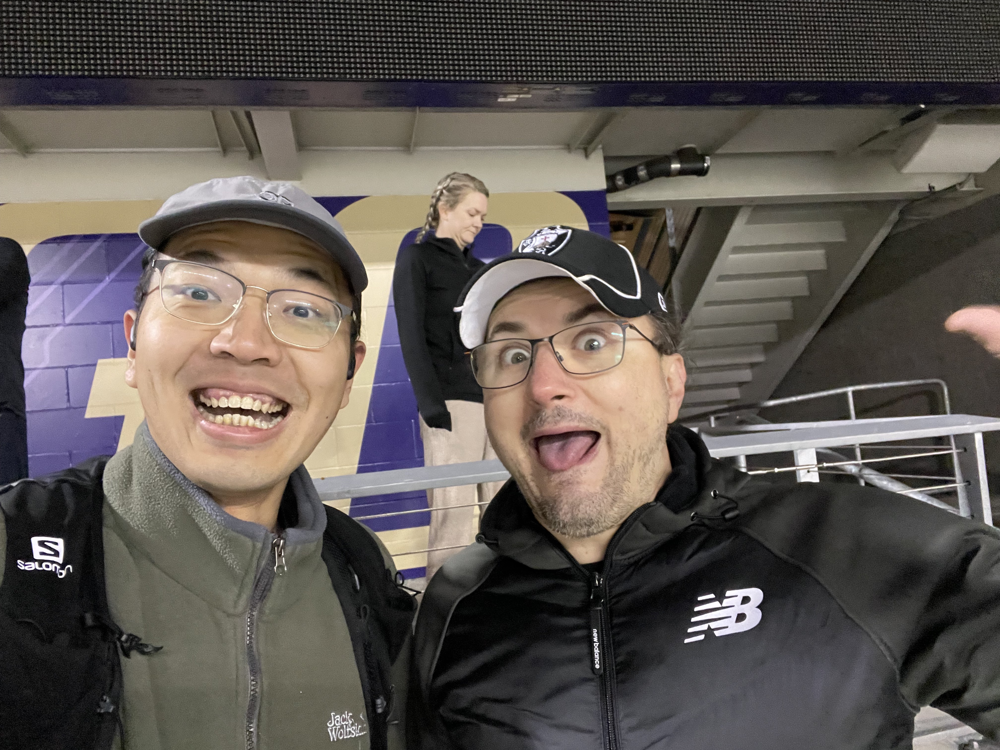
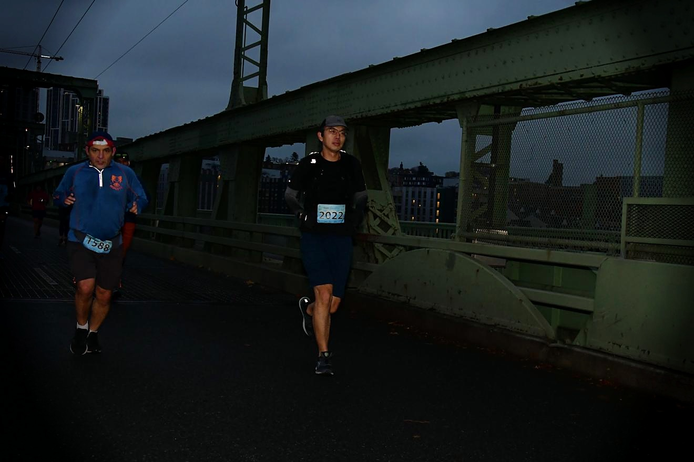
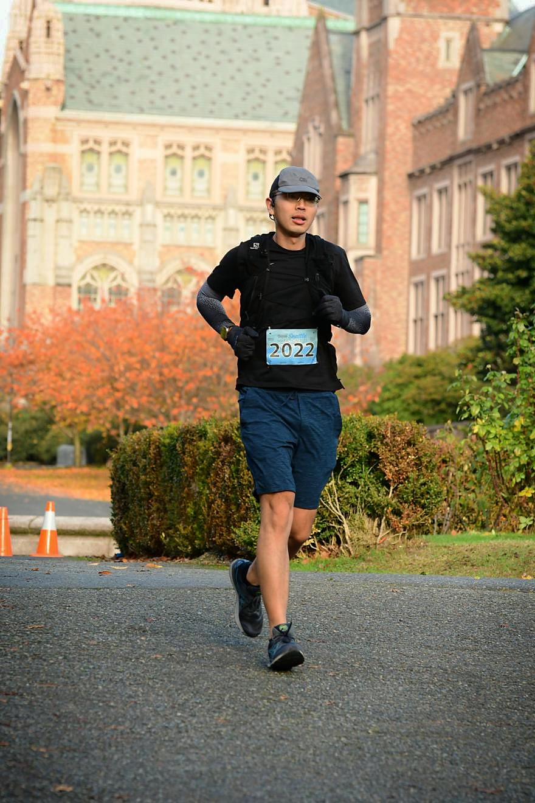
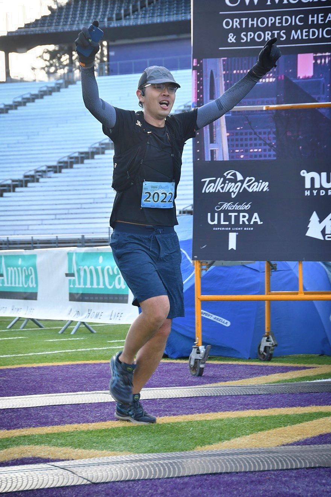

Saturday, November 26, 2022. I was running west toward Seattle on the 520 Bridge.

It was a typical cloudy Seattle day. A strong crosswind kept forcing me to hold onto my hat, so I had little attention left for Lake Washington on either side. I had been running for more than three hours and had just passed 19 miles, or 30 kilometers—a distance I had never reached in training. My legs grew heavier with every step while my heart rate continued to climb. Looking at Husky Stadium in the distance, I suddenly felt disoriented. How had I ended up here on Thanksgiving weekend?

The story probably begins ten years earlier.

Generally speaking, I try to be someone who does what he says.

Almost exactly ten years ago, I was eighteen and had just started college. At a gathering with my high school classmates, someone brought a video camera and asked each of us to say what we dreamed of doing in the future.

I said, **I am going to run a marathon.**

There was one problem: I did not run. As a confused teenager fresh out of the gaokao, I had never really thought about anything as grand as a dream. I had just read Haruki Murakami's *What I Talk About When I Talk About Running*. A marathon sounded cool, so I said it on a whim and promptly forgot about it. Then one day in my junior year, the promise came back to me. I also needed an escape from academic pressure, so I decided to start running.

I had no plan and knew nothing about pacing. I simply ran: three kilometers, five, seven, going all-out every time. Starting from the dorms in the west, I ran to the new library, the temple gate, the lawn outside the School of Electronic Information and Electrical Engineering, the Arc de Triomphe, and the microelectronics building. The Minhang campus, which had felt far too large even on a bicycle, suddenly did not seem so big beneath my feet. Running gave me a kind of happiness I had never experienced. It remains one of my best memories from college.

The good times did not last. During winter break, just after I passed three kilometers on one run, a sharp pain suddenly shot through my left knee. I thought two days of rest would fix it. Instead, the same pain returned every time I ran and made it impossible to continue. A hospital examination showed damage to the meniscus in my left knee. There was no particularly good treatment. It would not affect daily life, but excessive exercise was not recommended.

That diagnosis immediately killed my new enthusiasm for running. I could not believe that simply going for runs had somehow given me the kind of injury that could end a professional athlete's career. As frustrating as it was, I had no choice but to stop. I did not know whether I would ever fulfill that promise.

I ran a few times after coming to the United States, but never consistently. Thanks to the beautiful landscapes of the Pacific Northwest, I became enthusiastic about hiking instead. Yet every time I attempted a difficult route, my endurance became the limiting factor. This summer, I began wondering whether I should train seriously as a runner to improve it. My knee had not hurt for many years. Maybe it had somehow recovered?

Returning to running went fairly smoothly. This time I studied the subject, made a careful plan, and bought proper cushioned running shoes. The distance of each run gradually increased from five kilometers to more than ten. My pace, much like my hair, was no match for its college days, but at least my body showed no discomfort. Even then, I had not considered—or perhaps had not dared to consider—making a marathon the goal.

The turning point was the Berlin Marathon in September, which I watched from beginning to end. At thirty-eight, Eliud Kipchoge looked superhuman as he shattered his own world record once again and pushed the limit of what seemed humanly possible. I jumped up in excitement and decided to go for it on the next day's long run, just to see how far I could actually run. I started at Gas Works Park, followed Lake Union to Salmon Bay, made a large loop, and kept going until I had completed a half marathon.

It was the first half marathon of my life. To my surprise, it did not even feel that tiring. I finished smoothly. The first thing I did after returning home was open my computer and register for the full Seattle Marathon.

You know how my stories go: one or two plot twists are never enough.

In early October, I entered a university 10K. Finishing was not a concern; I expected to run at least under fifty minutes. Three days before the race, I did a progressive 15K and felt something strange in the back of my left thigh. The symptom was mild, so I did not think much of it and merely reduced my training over the next two days.

The feeling returned shortly after the 10K began. But no one thinks too carefully in the middle of a race. The cheers from the crowd can drown out everything. I held my pace. With one mile to go, the strange sensation became severe pain and I could no longer continue. I limped through the final stretch and finished in fifty-three minutes. I was devastated—not because I had injured myself, but because I had failed to break fifty.

The injury grew worse the next day. I could not move my left leg at all. I concluded that I had strained my hamstring, and not mildly. Perhaps I should have gone to the hospital, but the embarrassing truth was that I could not take a single step. The injury was not life-threatening, and I was too embarrassed to ask someone for help or call an ambulance.

Inside my room, I could roll around in a chair, which worked well enough. The real challenge was that getting from my room to the bathroom required climbing two steps. At that moment, they might as well have been a mountain. I tried several times and still could not get myself up. Eventually, sweating from exhaustion, I dropped onto the step. That evening I had just submitted a rebuttal destined for rejection. Sitting there, I suddenly felt an overwhelming sense of hurt and helplessness, stronger than anything I had felt even during my night on Mount St. Helens.

I knew that attempting a full marathon so soon was extremely unscientific. But I desperately needed a crazy goal to give my life some motivation. The past two years had not been good. I had experienced rejection after rejection. Some days, I never had the chance to say a single word to anyone.

Then again, who had enjoyed the past two years? Why indulge in self-pity? Face the problem. Solve the problem. Injury is part of sport, and no one feels comfortable at the end of a marathon. In an era when **running freely** has become a luxury for many people, I would recover properly and treasure every day when I was able to run.

The injury took nearly three weeks to heal, leaving exactly one month before the Seattle Marathon. I arranged my return to training more cautiously and increased the mileage with care. I realized that losing weight was the most important condition for finishing without another injury, so I began controlling my diet strictly. I lost ten jin—about eleven pounds—during that final month and arrived at the starting line at my lightest weight in five years.

One of the great pleasures of a marathon, besides the running itself, is the people you meet.

I was extremely nervous while waiting for the start, worried that I would be unable to finish or would injure myself again. The man next to me said hello and asked, "Where are you from?" I said China. He asked where in China. Assuming this was the usual polite American curiosity about someone's hometown, I said Hunan and added that it was not very famous, so he had probably never heard of it.

He suddenly asked me in Chinese, "Where in Hunan?"

I froze. Then he began telling me his story. The following conversation took place entirely in Chinese:

> "I studied and worked in China for five years. I attended two universities, but both were small, unknown schools."
>
> "Which schools?"
>
> "You definitely haven't heard of them. Very ordinary schools."
>
> "That's okay. Maybe I know them."
>
> "One was Peking University. The other was the Hong Kong University of Science and Technology."
>
> "..."
>
> "See, now you've stopped talking. You haven't heard of them, have you?"

I burst out laughing. This new friend, Chris, spoke excellent Chinese, but his sense of humor was still as dry as any American's. He told me that he worked in investment consulting. While living in China, he traveled everywhere and ran marathons in every province. After the pandemic, he left China and continued flying around the world. By then, he had completed eighty marathons. He had just returned from Istanbul, and after Seattle he would head to San Antonio and Dallas for two more.

Chris was full of energy and spoke incredibly fast. Through scholarships, he had collected several MBA degrees. He spoke English, Chinese, Korean, and Vietnamese. He loved sports and supported Beijing Guoan. He watched the CBA, the Chinese Super League, China League One, and even China League Two, then complained that we Chinese people only knew how to watch the NBA. Yes, an American made fun of me for watching the NBA. He was not particularly lean and looked almost cuddly, yet his marathon PR was 3:30. He had worked at several major companies but wore a pair of 361° shoes that cost 160 RMB because "Nike is too expensive."

Chris was a remarkable person. His story alone could fill another post. Meeting him was one of the great surprises of this marathon.

    

After the race started, there were even more interesting runners: someone dressed as Harry Potter in robes and carrying a wand, someone in pink pajamas, and people holding signs to raise money for charities. One runner veered to the side of the course to kiss his girlfriend, who was cheering for him, then charged forward with renewed energy. Everything was exciting and touching. The marathon no longer felt like a race so much as a huge party.

I had trained seriously because I wanted to race, but what kept me going was the simple fact that I enjoyed running. I began to relax and stopped obsessing over pace and heart rate. I thanked the volunteers, cheered, shouted, waved, and enjoyed every minute. Whether or not I finished this time, the road would always be here. I would keep running.

    

I had long heard that the real marathon begins at 30 kilometers. Now I understood.

After coming down from the 520 Bridge, my energy gradually ran out and the heaviness in my feet spread through my entire body. The energy gel in my hand and the hat on my head both seemed to weigh a thousand pounds. My speed began dropping beyond my control. The soles and tops of my feet, my IT bands, and every part of both legs took turns hurting. I checked my watch more and more often. Every tenth of a mile felt endless.

Finishing within my expected five-hour goal was no longer in doubt, but I felt no happiness at all. The excitement from earlier had been consumed by four hours of nonstop running. In my head, I cursed the ridiculous Seattle Marathon course: a giant hill followed by mud, as if no one could decide whether this was a city marathon or a trail race. Then I cursed myself. Why had I come here to suffer? I could think only that I never wanted to run another marathon.

That mood lasted until I entered the UW campus. I ran past EEB, then around the fountain, through familiar places I had not seen in a long time. I had passed 25 miles, or 40 kilometers. Only a little over two kilometers remained. I forced out the last of my strength and charged toward the finish.

    

The moment I ran into Husky Stadium, all the tension, worry, exhaustion, and pain disappeared. The story reached its climax:

On a day like this, in a city like this, I entered a race like this, met people like these, ran through a campus like this, and charged into a stadium like this.

This was no longer simply finishing 42 kilometers. I had fulfilled a promise made to myself ten years earlier. In 2022, wearing bib number 2022, I experienced one of the happiest times of my life.

Perhaps this is the greatest appeal of the marathon. It is an extreme sport with real risk and real difficulty. Yet almost anyone in good health can complete one after systematic, demanding training.

**It is a sport in which you compete against your past self, not against other people.**

At the finish line, you see people of every age, gender, height, and body type receive their own medals. You realize that all these different people may have done the same things you did: waking before sunrise, training through wind and rain, giving up alcohol and sugar, enduring all kinds of injuries, and accomplishing everything they once believed impossible. You feel a genuine sense of belonging and achievement.

So why run?

Because I want to **live an uncommon life**.

> People constantly mock those who run every day: "Do you really want to live to a hundred that badly?" But I suspect that very few people run because they hope to live to a hundred. Far more run with the feeling that "it does not matter if I fail to live to a hundred; I only want to live as fully as possible while I am alive." Given the same ten years, living with clear purpose and vitality is far more satisfying than drifting through them in confusion. This is surely a great part of running's appeal: within the limits of the individual, it allows you to burn yourself effectively—even if only a little. That is the essence of running.
>
> — Haruki Murakami

    

