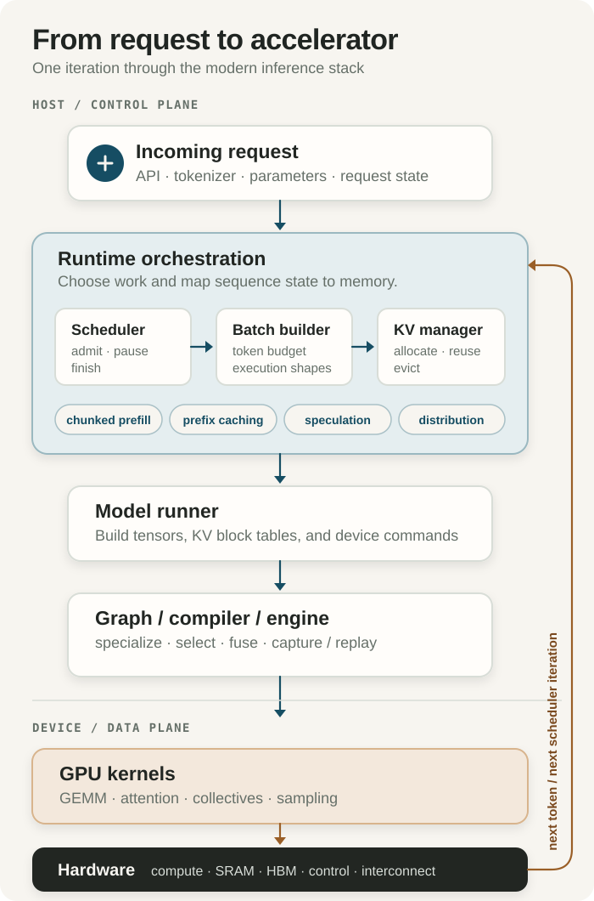

<button class="note-sidebar-toggle" type="button" aria-expanded="true" aria-label="Hide navigation">
  <span></span><span></span><span></span>
</button>

<style>
.note-sidebar-toggle {
  position: fixed;
  top: 6rem;
  left: 1rem;
  z-index: 10;
  display: inline-flex;
  width: 2.35rem;
  height: 2.35rem;
  padding: 0.55rem;
  flex-direction: column;
  justify-content: center;
  gap: 0.24rem;
  color: var(--accent);
  background: var(--page);
  border: 1px solid var(--line);
  border-radius: 0.4rem;
  cursor: pointer;
}
.note-sidebar-toggle:hover,
.note-sidebar-toggle:focus-visible { background: var(--accent-soft); }
.note-sidebar-toggle span {
  display: block;
  width: 100%;
  height: 2px;
  background: currentColor;
  border-radius: 1px;
}
.knowledge-shell.sidebar-collapsed {
  grid-template-columns: minmax(0, 700px);
  justify-content: center;
}
.knowledge-shell.sidebar-collapsed .knowledge-sidebar { display: none; }
@media (max-width: 760px) {
  .note-sidebar-toggle { display: none; }
}
</style>

<script>
(() => {
  const button = document.querySelector('.note-sidebar-toggle');
  const shell = button?.closest('.knowledge-shell');
  if (!button || !shell) return;

  const key = 'huwan-note-sidebar-collapsed';
  const apply = (collapsed) => {
    shell.classList.toggle('sidebar-collapsed', collapsed);
    button.setAttribute('aria-expanded', String(!collapsed));
    button.setAttribute('aria-label', collapsed ? 'Show navigation' : 'Hide navigation');
  };

  apply(localStorage.getItem(key) === 'true');
  button.addEventListener('click', () => {
    const collapsed = !shell.classList.contains('sidebar-collapsed');
    apply(collapsed);
    localStorage.setItem(key, String(collapsed));
  });
})();
</script>

## 1. The problem in one sentence

An LLM inference runtime turns many irregular, stateful requests into a sequence of hardware-efficient model executions while meeting latency, throughput, memory, and correctness constraints.

Calling the model once is not the hard part. A production server must continuously decide:

- which requests run in the next iteration;
- how many prompt or generated tokens each may process;
- where every request's KV state lives;
- which execution shape, graph, kernels, and devices to use;
- when to admit, pause, resume, finish, or distribute work.

The runtime is therefore both a **resource manager** and an **execution orchestrator**. It converts a changing request-level workload into tensor operations that kernels and hardware can execute efficiently.

> The runtime decides *what work exists now and how it is grouped*; kernels decide *how each selected operation runs on the device*.

## 2. The end-to-end path

<figure>
  
  <figcaption>The host control plane creates a hardware-ready iteration; the device data plane executes it and returns for the next token.</figcaption>
</figure>

One scheduler iteration usually performs a mixture of two kinds of work:

- **Prefill:** process prompt tokens and create their KV state. It exposes substantial parallelism and is often compute-intensive.
- **Decode:** process the newest token using all prior KV state, produce the next-token distribution, sample, and append new KV. Each sequence contributes little matrix work per step, so weight/KV traffic and launch latency often dominate.

The loop is dynamic: requests arrive and finish at different times, sequence lengths grow, cache capacity changes, and a batch that is efficient now may not exist one token later.

## 3. What each stage owns

| Layer | Owns | Does not fundamentally own |
|---|---|---|
| Host/runtime software | Request queues, scheduling policy, continuous batching, token budgets, admission/preemption, KV-block bookkeeping, prefix lookup, distributed coordination, output streaming | The instruction-level implementation of GEMM or attention |
| Graph/compiler execution | Model graph, shape specialization, operator selection, graph partitioning/fusion, memory planning, CUDA Graph capture/replay, dispatch to compiled engines or generated code | Global request fairness and service-level policy |
| GPU kernels | Tiled GEMM, attention over paged KV, normalization, activation, MoE routing, collectives, logits/sampling, fused operator sequences | Which users should share an iteration or which request should be evicted |
| Hardware | Matrix/vector arithmetic, register files and SRAM, HBM capacity/bandwidth, DMA, synchronization, launch mechanisms, chip-to-chip communication | Semantic request state unless software maps it onto hardware mechanisms |

These are responsibility boundaries, not hard process boundaries. A fused kernel may absorb graph operators; device-side scheduling may absorb host decisions; a compiler may choose a kernel and its memory layout together.

## 4. Where the major runtime techniques fit

| Technique | Primary location | What changes in the execution stream | Main architectural pressure |
|---|---|---|---|
| **Continuous batching** | Scheduler | Rebuilds the active batch each iteration as requests enter and leave | Variable shapes, short iterations, launch and scheduling overhead |
| **Chunked prefill** | Scheduler + KV manager | Splits a long prompt across iterations so decode traffic and other prompts can interleave | Mixed prefill/decode shapes; better fairness, possibly less GEMM efficiency |
| **Prefix caching** | KV manager | Reuses KV blocks for an identical already-computed prefix, skipping part of prefill | Cache capacity, block granularity, lookup metadata, isolation and eviction policy |
| **CUDA Graphs** | Graph execution / launch layer | Captures a repeated device-operation sequence and replays it with lower CPU launch overhead | Dynamic batches must map to captured shapes, often using buckets or padding |
| **Speculative decoding** | Runtime + model execution + kernels | A cheap proposer drafts several tokens; the target model verifies them together | Extra state and control flow exchanged for more useful work per target-model pass |
| **Distributed execution** | Runtime + kernels + interconnect | Shards model or requests and inserts collectives or KV transfers | Collective latency/bandwidth, synchronization, topology, load balance |

These techniques compose, but not freely. For example, chunked prefill changes iteration shapes; CUDA Graphs prefer repeatable shapes; speculative verification changes tokens per sequence; and tensor parallelism adds collectives to every layer. Runtime performance is the quality of the whole policy-and-execution combination, not the sum of isolated optimizations.

<details>
<summary>Continuous batching, static batching, and chunked prefill</summary>

A static batch waits for all sequences in the batch to finish. Autoregressive requests rarely have equal output length, so finished slots waste capacity.

Continuous batching—also called in-flight or iteration-level batching—reconsiders membership at generation-step boundaries. A finished sequence can leave and a waiting sequence can enter. TensorRT-LLM explicitly describes in-flight batching as allowing context-phase and generation-phase sequences to be processed together; vLLM and SGLang expose the same broad serving behavior through their schedulers.

A long prefill can consume an entire iteration's token budget and delay decode requests. Chunked prefill bounds the number of prompt tokens admitted in one iteration. This improves interactivity and mixing, but turns one large, regular prefill into several smaller executions and creates a policy trade-off between time-to-first-token, inter-token latency, and throughput.

</details>

<details>
<summary>Prefix caching is not ordinary CPU-style caching</summary>

The reusable object is the model's layer-by-layer KV state for a token prefix. A hit avoids recomputing that prefix; it does not eliminate decode work for new tokens. Correctness also depends on all inputs that affect the KV values—not merely matching visible text.

vLLM uses hash-addressed KV blocks for automatic prefix caching. SGLang's RadixAttention organizes reusable prefixes in a radix tree, which naturally represents sharing among many branching prompts. TensorRT-LLM calls the analogous capability KV-cache block reuse. The data structure differs, but all three connect request identity and prefix matching to physical KV pages.

</details>

## 5. The three runtimes: same vertical slice, different center of gravity

| Runtime | Broad role | Architectural center of gravity | Useful hardware-level reading |
|---|---|---|---|
| **vLLM** | Open-source model serving and inference engine | Flexible scheduler/model runner plus paged KV-cache management; PyTorch model execution with compiler and CUDA Graph integration | A canonical example of turning dynamic sequences into block-mapped attention and continuously scheduled batches |
| **SGLang** | Serving runtime plus a frontend for structured and agentic model programs | Prefix-aware execution through RadixAttention, aggressive request/program reuse, and a broad set of backend kernels and distributed modes | Shows how higher-level request structure can become cache reuse and scheduling opportunities |
| **TensorRT-LLM** | NVIDIA's LLM optimization toolkit and runtime stack | TensorRT engine construction, NVIDIA-specialized plugins/kernels, and Python/C++ execution components with in-flight batching and KV management | Shows tight co-design among graph specialization, runtime policy, kernels, CUDA, and a particular GPU platform |

### vLLM

vLLM's online path separates API handling from an engine core and GPU workers. The engine handles scheduling and distributed model execution; each worker's model runner prepares tensors, runs the model, and manages CUDA Graph capture. Its defining historical contribution is **PagedAttention**: KV state is mapped in blocks rather than requiring one contiguous allocation per sequence. This reduces fragmentation and lets the scheduler treat KV capacity as a block pool.

The correct mental model is not “vLLM is one attention kernel.” It is a serving engine whose scheduler, KV manager, model runner, compiler integration, CUDA Graphs, and kernel backends cooperate.

### SGLang

SGLang spans both the expression of multi-call language-model programs and their execution. Its distinctive abstraction is **RadixAttention**: a radix tree tracks token prefixes and their KV pages so prefix sharing survives across requests and branching program paths. Modern SGLang is also a general production serving framework with continuous batching, chunked prefill, speculative decoding, multiple attention backends, and single-node or distributed execution.

The useful distinction from vLLM is emphasis, not exclusivity. Both cache prefixes and both optimize scheduling. SGLang makes reusable prefix structure especially central to its runtime model and originated with a frontend designed for structured generation programs.

### TensorRT-LLM

TensorRT-LLM combines model definition and optimization, TensorRT engine construction, NVIDIA-tuned plugins/kernels, and Python/C++ runtime components. Its executor supplies the serving-time mechanisms—request scheduling, in-flight batching, paged KV-cache management, sampling, speculative modes, and multi-GPU/multi-node execution—while TensorRT specializes and executes the model graph.

Its center of gravity is tighter NVIDIA vertical integration. That can enable strong graph/kernel/hardware co-optimization, while tying the execution path more closely to NVIDIA's supported models, precisions, plugins, and GPU generations. Current TensorRT-LLM also exposes a PyTorch backend, so “ahead-of-time engine only” is no longer a complete description; compiled TensorRT engines remain a core architectural path.

> All three are full inference stacks. Their names identify where each project places the most architectural leverage, not exclusive ownership of a single layer.

<details>
<summary>Feature comparison without false precision</summary>

| Capability | vLLM | SGLang | TensorRT-LLM |
|---|---|---|---|
| Online serving and request scheduler | Yes | Yes | Yes |
| Continuous / in-flight batching | Yes | Yes | Yes |
| Paged/block KV allocation | Yes | Yes | Yes |
| Cross-request prefix reuse | Hash-addressed blocks | Radix-tree-based RadixAttention | KV block reuse |
| Chunked prefill/context | Yes | Yes | Yes, subject to backend/model limits |
| CUDA Graph execution | Yes on CUDA | Yes on CUDA | Yes on CUDA |
| Speculative decoding | Multiple proposer modes | Multiple proposer modes | Multiple NVIDIA-supported modes |
| Distributed execution | Tensor/data/pipeline and disaggregated modes | Tensor/data/expert/pipeline and disaggregated modes | Multi-GPU and multi-node modes |
| Hardware scope | Multiple accelerator backends | Multiple accelerator backends | NVIDIA GPU stack |

Feature support changes quickly and varies by model, backend, and execution mode. This table is a map of broad responsibilities, not a compatibility matrix or benchmark ranking.

</details>

## 6. What matters most to an accelerator architect

The highest-value questions are not “Which server API is cleaner?” They are:

1. **What shapes reach the device?** Prefill brings many tokens and large GEMMs; decode brings small per-sequence work, growing KV reads, and highly variable batches. Continuous batching and chunking determine the actual shape distribution.
2. **What state dominates capacity and traffic?** Weights are repeatedly streamed; KV capacity grows with active sequence length and concurrency; MoE adds expert-weight traffic and routing imbalance. The runtime's block size and eviction policy translate physical memory into usable concurrency.
3. **How expensive is orchestration?** Short decode iterations expose CPU scheduling, kernel launch, graph selection, synchronization, and sampling overhead. A faster matrix unit cannot hide a starved command path.
4. **Where does regularity come from?** Graph buckets, padding, token budgets, block layouts, and batch policies manufacture regular shapes from irregular requests. Hardware features are useful only if the runtime/compiler can map its live workload onto them.
5. **What crosses chip boundaries?** Tensor parallelism adds reductions; pipeline parallelism adds stage bubbles; expert parallelism adds all-to-all traffic; prefill/decode disaggregation adds KV transfer. Interconnect is part of token latency.
6. **Which optimization changes the bottleneck?** Quantization may move a decode step from bandwidth-bound toward compute-bound. Prefix hits remove prefill work. Speculation increases tokens per target pass but adds verification and draft overhead. The roofline moves with runtime policy.

A good accelerator study should therefore measure distributions, not only peak kernels: tokens per iteration, active sequences, context lengths, prefix-hit rates, KV occupancy, graph-bucket hit rates, collective sizes, and time spent between device executions.

## 7. Why this model leads to fusion, persistent kernels, and MegaKernel

The conventional boundary is:

```text
host chooses an iteration
  -> graph launches many kernels
  -> each kernel loads/stores intermediates
  -> host observes progress and schedules again
```

The next three topics progressively move work across that boundary:

| Technique | What it removes | What must become more specialized |
|---|---|---|
| **Kernel fusion** | Intermediate memory traffic and launches between adjacent operators | A larger kernel owns more of the graph and its dataflow |
| **Persistent kernel** | Repeated launch/setup and some state movement across iterations or tiles | Device code retains resources and accepts new work over time |
| **MegaKernel / device-side scheduling** | Much of the host-driven operator and token-step orchestration | A device-resident program performs heterogeneous work selection, synchronization, and execution |

This is why runtime knowledge comes first. Fusion is not merely combining arithmetic; it changes graph boundaries and temporary storage. Persistence is not merely a long-running kernel; it changes resource ownership and admission. A MegaKernel is not merely very large; it absorbs part of the runtime's scheduling role into the device.

The central co-design question is:

> Which decisions are regular and latency-critical enough to move closer to the hardware, and which remain too dynamic or policy-heavy to leave the host runtime?

## 8. Final architectural model

From a request to silicon:

1. The **serving layer** parses the request and maintains user-visible state.
2. The **scheduler** selects token work and forms a continuously changing batch.
3. The **KV manager** maps logical sequence history onto physical cache blocks and may reuse prefixes.
4. The **model runner** materializes tensors and metadata for that iteration and coordinates devices.
5. The **graph/compiler layer** selects or constructs an executable form, often using specialization and CUDA Graph replay.
6. **Kernels** perform attention, matrix operations, collectives, and sampling.
7. The **hardware** supplies compute, memory hierarchy, launch/control, and interconnect—and exposes the limits the upper layers must schedule around.

The few-minute explanation is:

> vLLM, SGLang, and TensorRT-LLM sit between requests and GPU kernels as inference runtimes. They schedule changing token workloads, build continuous batches, manage and reuse KV state, execute the model through graph/compiler layers, and dispatch optimized kernels across one or more accelerators. vLLM emphasizes flexible serving with paged KV management, SGLang emphasizes prefix- and program-aware execution, and TensorRT-LLM emphasizes NVIDIA-specific graph/runtime/kernel co-optimization.

## References

- vLLM, [Architecture Overview](https://docs.vllm.ai/en/latest/design/arch_overview/), [Paged Attention](https://docs.vllm.ai/en/latest/design/paged_attention/), and [Automatic Prefix Caching](https://docs.vllm.ai/en/latest/design/prefix_caching/).
- Woosuk Kwon et al., [“Efficient Memory Management for Large Language Model Serving with PagedAttention”](https://arxiv.org/abs/2309.06180), SOSP 2023.
- SGLang, [official documentation](https://docs.sglang.io/) and [advanced features](https://docs.sglang.io/docs/advanced_features/overview).
- Lianmin Zheng et al., [“SGLang: Efficient Execution of Structured Language Model Programs”](https://arxiv.org/abs/2312.07104).
- NVIDIA, [TensorRT-LLM Architecture](https://nvidia.github.io/TensorRT-LLM/architecture/overview.html), [Paged Attention, In-Flight Batching, and Request Scheduling](https://nvidia.github.io/TensorRT-LLM/latest/features/paged-attention-ifb-scheduler.html), and [KV Cache System](https://nvidia.github.io/TensorRT-LLM/latest/features/kvcache.html).
- NVIDIA, [CUDA Graphs](https://docs.nvidia.com/cuda/cuda-c-programming-guide/index.html#cuda-graphs) in the CUDA Programming Guide.
