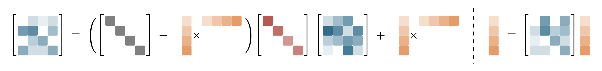

## 1. Original Linear Attention

**Standard Attention**:

  $$\mathbf{O} = \text{softmax}(\mathbf{Q} \mathbf{K}^\top) \mathbf{V}$$

where $\mathbf{Q},\mathbf{K},\mathbf{V} \in \mathbb{R}^{L \times D}$.

The self-attention mechanism can be think of calculate similarities of a query vector over all and value vectors, and can be rewrite to a generalized attention equation for any similarity function *sim* as follows,

  $$\mathbf{o}_t = \sum_{j=1}^t\frac{ \text{sim}(\mathbf{q}_t, \mathbf{k}_j) \mathbf{v}_j}{\sum_{j=1}^t \text{sim}(\mathbf{q}_t, \mathbf{k}_j)}$$

where small case letters with underscribe $t$ means the t-th row vector ($\mathbb{R}^D$) of the original matrix, and the well known standard attention just use the similarty function $\text{sim}(\mathbf{q}, \mathbf{k}) = \exp\left(\frac{\mathbf{q}^\top \mathbf{k}}{\sqrt{D}}\right)$.

The problems of the standard attention is obvious: for every new output $\mathbf{o}_t$, it needs calculate the latest query vector $q_i$ calculate over all key and value vectors $\mathbf{k}_j, \mathbf{v}_j, j\in[1, t]$, which adds lots of memory and compute overhead.

**Linear Attention** [cite]:

It creates a new similiarity function with dot-product $\text{sim}(\mathbf{q}, \mathbf{k})=\phi(\mathbf{q})^\top\phi(\mathbf{k})$, where $\phi$ is a feature map $\mathbb{R}^d \to \mathbb{R}^d$. 
Thus, we can rewrite the above attention function as follows,

  $$\mathbf{o}_t = \sum_{j=1}^t\frac{ \phi(\mathbf{q}_t)^\top\phi(\mathbf{k}_j)  \mathbf{v}_j}{\sum_{j=1}^t \phi(\mathbf{q}_t)^\top\phi(\mathbf{k}_j) }$$

and we can simplify it using the associative property of matrix multiplication to

  $$\mathbf{o}_t = \frac{ \phi(\mathbf{q}_t)^\top \sum_{j=1}^i \phi(\mathbf{k}_j)  \mathbf{v}_j^\top}{\phi(\mathbf{q}_t)^\top \sum_{j=1}^t \phi(\mathbf{k}_j) } = \frac{\mathbf{S}_t \phi(\mathbf{q}_t)} {\mathbf{z}_t^\top  \phi(\mathbf{q}_t)}$$

where $\mathbf{S}\_t = \sum_{j=1}^t \mathbf{v}\_j \phi(\mathbf{k}\_j)^\top \in \mathbb{R}^{D\times D}$, 
and $\mathbf{z}\_t=\sum_{j=1}^t \phi(\mathbf{k}_j) \in \mathbb{R}^{D}$, and we can see the numerator is a $\mathbb{R}^D$  vector and the denominator is a scalar.

Later reserch show that removing the denominator helps the numerical stability and the identity mapping works well for $\phi$, as a result, we can even futhuer rearrange computations to represent it as a linear RNN with matrix-valued hidden states:
  $$\begin{aligned}
  \mathbf{o}_t &= \mathbf{S}_t\mathbf{q}_t \\
  \mathbf{S}_t &= \mathbf{S}_{t-1} + \mathbf{k}_t \mathbf{v}_t^\top
  \end{aligned}$$

**Why it matters**: It effectively "compresses" the history of all keys and values $\mathbf{K},\mathbf{V} \in \mathbb{R}^{L\times D}$ into this fixed-size state matrix $\mathbf{S} \in \mathbb{R}^{D\times D}$.
It reduces the memory size requirement, (per-step) compute and memory I/O from $O(LD)$ to $O(D^2)$, where $L$ is the number of tokens, usually is way larger than the head dimention size $D$.

## 2. The Delta Rule (DeltaNet)

Essentially, the state $\mathbf{S}$ in Linear Attention is a key-value associative memory.
The problem of the original state update rule is it just keeps adding. 
The numbers get huge, and old info never goes away. 
If you show the model the pair (Key="Apple", Value="Red") and later (Key="Apple", Value="Green"), it essentially blends them ($\mathbf{S}$ contains "Red" + "Green"). 
It cannot "overwrite" or "update" specific facts efficiently; it just accumulates noise. 
This leads to poor *Associative Recall* (the ability to precisely retrieve a specific value for a specific key).
As someone said: 

> The enemy of memory is not time; it’s other memories.

The **Delta Rule** [cite] introduces a "correction" mechanism. 
Instead of just adding the new data, it calculates the difference (Delta) between what the state currently predicts and what the actual value is, then updates the state to minimize that error:

$$\mathbf{S}_t = \mathbf{S}_{t-1} - \beta_t (\mathbf{S}_{t-1} \mathbf{k}_t - \mathbf{v}_t) \mathbf{k}_t^\top$$

where $\beta$ is the learning rate.

We can have two interpretations of the Delta Rule in the context of Linear Attention.

### 2.1 The Optimization Perspective: Online SGD on Regression
   
This perspective treats matrix $\mathbf{S}$ not just as a state, but as a set of **weights** for a linear model. The model is "training" itself on the current token to better *predict the value from the key*.

- **The Objective (Loss Function)**: At step $i$, we want the matrix $S$ to map the current key $K_i$ to the current value $V_i$. We can define the "error" using the standard Mean Squared Error (Regression Loss):
  $$\mathcal{L}_t(\mathbf{S}) = \frac{1}{2} \| \mathbf{S} \mathbf{k}_t - \mathbf{v}_t \|^2$$

- **The Gradient**: We want to update $\mathbf{S}$ to minimize this loss, so we calculate the gradient of the loss with respect to the matrix $\mathbf{S}$:

  $$\nabla_\mathbf{S} \mathcal{L}_t = \underbrace{(\mathbf{S} \mathbf{k}_t - \mathbf{v}_t)}_{\text{Error Vector } e_t} \cdot \mathbf{k}_t^\top$$

- **The Update**: We apply a single step of Stochastic Gradient Descent (SGD) with a learning rate $\beta_i$:

  $$ \mathbf{S}_t = \mathbf{S}_{t-1} - \beta_t \nabla_\mathbf{S} \mathcal{L}_t(\mathbf{S}_{t-1}) $$

  Substituting the gradient from above and we get the exact Delta Rules:

  $$\mathbf{S}_t = \mathbf{S}_{t-1} - \beta_t (\mathbf{S}_{t-1} \mathbf{k}_t - \mathbf{v}_t) \mathbf{k}_t^\top$$

<!-- Interpretation:
- "Training on the fly": The Linear Transformer is essentially training a linear regression model on the sequence history as it reads it.
- $\beta_i$: This acts as the step size. If $\beta_i$ is calculated optimally (e.g., inversely proportional to the norm of keys), this becomes equivalent to Recursive Least Squares, which converges much faster than standard SGD. -->
  
### 2.2 The Retrieval Perspective: Associative Memory with Correction

This perspective views the state $\mathbf{S}$ as a database. 
We want to store pairs $(\mathbf{k}, \mathbf{v})$ so that we can retrieve $\mathbf{v}$ later by querying with $\mathbf{k}$.

Original linear attention uses simple addition: $\mathbf{S}_t = \mathbf{S}\_{t-1} + \mathbf{v}_t \mathbf{k}_t^\top$. 
When we query the database with $\mathbf{k}_t$ to retrieve $\mathbf{v}_t$, we get:

$$\begin{aligned}
\mathbf{v}^{\prime}_t &= \mathbf{S}_{t} \mathbf{k}_t  \\
             &= (\mathbf{S}_{t-1} + \mathbf{v}_t \mathbf{k}_t^\top) \mathbf{k}_t \\
             &= (\mathbf{S}_{t-2} + \mathbf{v}_{t-1} \mathbf{k}_{t-1}^\top + \mathbf{v}_t \mathbf{k}_t^\top) \mathbf{k}_t \\
             &... \\
             &= \left( \sum_{i=1}^{t-1} \mathbf{v}_i \mathbf{k}_i^\top \right) \mathbf{k}_t \\
             &= \sum_{i=1}^{t} \mathbf{v}_i (\mathbf{k}_i^\top \mathbf{k}_t)
\end{aligned}$$

**Interference**: 
Every single past item from the beginng ($i=1$) to current ($i=t$)  contributes to the current output based on the dot product $(\mathbf{k}_i^\top \mathbf{k}_t)$.
- If Keys were "Perfect" (Orthogonal), i.e., $\mathbf{k}_i^\top \mathbf{k}_t = 0$ for all $i \ne t$. The sum of past values would be $0$, we have $\mathbf{v}^{\prime}_t=\mathbf{v}_t$.
- In high dimensions, random vectors are rarely perfectly orthogonal. There is always some "overlap" or correlation. As the context length increases, even if the overlap is tiny, the summated "noise" becomes huge.

In the Delta Rule, instead of just adding the new value, we first check what the memory already thinks the value is using the current key, $S_{old} k_{new}$, and subtracts it from the target value:
$$\mathbf{S}_{new} = \mathbf{S}_{old} + \beta_t (\mathbf{v}_{target} - \underbrace{\mathbf{S}_{old} \mathbf{k}_{new}}_{\mathbf{v}_{predict}}) \mathbf{k}_{new}^\top$$
so we have
$$\mathbf{S}_{t} = \mathbf{S}_{t-1} + \beta_t (\mathbf{v}_{t} - \mathbf{S}_{t-1} \mathbf{k}_{t}) \mathbf{k}_{t}^\top$$

If we query the matrix immediately after the update (assuming normalized keys $\mathbf{k}_t^\top \mathbf{k}_t = 1$ and step size $\beta_t=1$ for simplicity):
$$\begin{aligned} \mathbf{S}_t \mathbf{k}_t &= ( \mathbf{S}_{t-1} + \beta_t (\mathbf{v}_{t} - \mathbf{S}_{t-1} k_{t}) k_{t}^\top) \mathbf{k}_t \\ 
&= \mathbf{S}_{t-1} \mathbf{k}_t + (\mathbf{v}_t - \mathbf{S}_{t-1} \mathbf{k}_t) (\mathbf{k}_t^\top \mathbf{k}_t) \\ 
&= \mathbf{S}_{t-1} \mathbf{k}_t + \mathbf{v}_t - \mathbf{S}_{t-1} \mathbf{k}_t \\ &= \mathbf{v}_t \end{aligned}$$

In the real implementation, we often set the learning rate dynamically $\beta_t \in (0,1)$. 
When $\beta_t = 0$, the memory content remains intact; and when  $\beta_t = 1$, we completely replace the old associated value with the new one.

## 3. Hardware-Efficient Chunkwise Algorithm

cite: Parallelizing Linear Transformers with the Delta Rule
over Sequence Length

As we can see, Linear Attention transfers the highly parralized original attention $(\mathbf{Q}\mathbf{K}^\top)\mathbf{V}$ into a recurrent form.
Though this reduces total memory and compute costs, can hurt the overall system throughput, especialy in the prefil stage.

In the prefill, input is a sequence with multiple tokens, if we we only used the recurrent formula ($\mathbf{S}_t = S\_{t-1} + \dots$), we need to wait for the previous token to finish before starting the next one. 
Since the computation of each token is often small, this leads terrible hardware utilization and low throughput.

### 3.1 Chunkwise Parallelism
**Chunkwise Parallelism** is a hybrid approach that combines both the parallel and sequantial methods.
Instead of calculating intermediate hidden states for every token sequentially, we can update states at regular intervals of size $C$ (the chunk size). This allows us to exploit parallel matrix multiplication.

#### 3.1.1 The state update (inter-chunk)
First, we express the recurrent state update for a full chunk. For a chunk starting at time 1 and ending at time $C$, the end state is the sum of the previous state ($\mathbf{S}_0$) and all key-value updates within the chunk:
$$\begin{aligned}
  \mathbf{S}_{C} &= \mathbf{S}_{C-1} + \mathbf{v}_{C}\mathbf{k}_{C}^\top \\
                 &= \mathbf{S}_{C-2} + \mathbf{v}_{C-1}\mathbf{k}_{C-1}^\top + \mathbf{v}_{C}\mathbf{k}_{C}^\top \\
                 &= \mathbf{S}_{0} + \sum_{i=1}^{C} \mathbf{v}_{i} \mathbf{k}_{i}^\top \\
                 &= \mathbf{S}_{0} + \mathbf{V}_{1:C}^\top \mathbf{K}_{1:C}
\end{aligned}$$

where $\mathbf{V}\_{1:C}, \mathbf{K}\_{1:C} \in \mathbb{R}^{C \times D}$. The term $\mathbf{V}\_{1:C}^\top \mathbf{K}\_{1:C}$ results in a $D \times D$ matrix. Unlike the sequential sum, this matrix multiplication can be efficiently parallelized on hardware.

#### 3.1.2 The output calculation (intra-chunk)
Next, we derive the output for any specific token $r$ inside the chunk (where $1 \le r \le C$). The output vector $\mathbf{o}_r$ is derived from the current state $\mathbf{S}_r$ and the query $\mathbf{q}_r$:
$$\begin{aligned}
  \mathbf{o}_{r} &= \mathbf{S}_{r} \mathbf{q}_{r} \\
        &= \left( \mathbf{S}_{0} + \sum_{i=1}^{r} \mathbf{v}_{i} \mathbf{k}_{i}^\top \right) \mathbf{q}_{r} \\
        &= \mathbf{S}_0 \mathbf{q}_{r}+ \sum_{i=1}^{r} \mathbf{v}_{i} (\mathbf{k}_{i}^\top \mathbf{q}_{r})
\end{aligned}$$

#### 3.1.3 Matrix Form
By stacking the vectors into matrices for the entire chunk, we can compute all outputs $O_{1:C} \in \mathbb{R}^{C \times D}$ in parallel:
$$\mathbf{O}_{1:C} = \underbrace{\mathbf{Q}_{1:C} \mathbf{S}_0^\top}_{\text{Recurrent Part}} + \underbrace{\text{Mask}(\mathbf{Q}_{1:C} \mathbf{K}_{1:C}^\top) \mathbf{V}_{1:C}}_{\text{Parallel Part}}$$

- **Recurrent Part**: $\mathbf{Q} \mathbf{S}_t^\top$ applies the historical context to all queries in the chunk simultaneously.
- **Parallel Part**: The second term is standard self-attention (masked to be causal) confined within the chunk.

This demonstrates that we can effectively parallelize computation within chunks while maintaining linear complexity over the full sequence.

<!-- 
Proof:

Let's look at the second term (the Local Attention part) for the first 3 tokens in your chunk ($r=1, 2, 3$).
- Token 1 ($r=1$): Sums $i$ from 1 to 1.
  $$o_1 = v_1 (k_1^\top q_1)$$
- Token 2 ($r=2$): Sums $i$ from 1 to 2.
  $$o_2 = v_1 (k_1^\top q_2) + v_2 (k_2^\top q_2)$$
- Token 3 ($r=3$): Sums $i$ from 1 to 3.
  $$o_3 = v_1 (k_1^\top q_3) + v_2 (k_2^\top q_3) + v_3 (k_3^\top q_3)$$

Notice the pattern? Token 1 sees only index 1.Token 2 sees 1 and 2.Token 3 sees 1, 2, and 3.It cannot see the future (e.g., Token 1 cannot see index 2).

If you just multiply $\mathbf{Q} \mathbf{K}^\top$ without doing anything else, you calculate the scores for everyone looking at everyone.

Let $A = \mathbf{Q} \mathbf{K}^\top$ (the score matrix).

$$A =
\begin{bmatrix}
q_1 k_1^\top & q_1 k_2^\top & q_1 k_3^\top \\
q_2 k_1^\top & q_2 k_2^\top & q_2 k_3^\top \\
q_3 k_1^\top & q_3 k_2^\top & q_3 k_3^\top
\end{bmatrix}$$

If you multiply this by $\mathbf{V}$, Token 1 (Row 1) would add up $q_1 k_1^\top v_1 + \mathbf{q_1 k_2^\top v_2} + \mathbf{q_1 k_3^\top v_3}$.
This is wrong. It includes future information (bolded).

To match your summation $\sum_{i=1}^r$, we must zero out the entries where the column index $i$ is greater than the row index $r$. This creates a Lower Triangular Matrix.Let's apply the mask (often called tril or causal mask) to $A$:
$$\text{Mask}(\mathbf{Q} \mathbf{K}^\top) =
\begin{bmatrix}
q_1 k_1^\top & 0 & 0 \\
q_2 k_1^\top & q_2 k_2^\top & 0 \\
q_3 k_1^\top & q_3 k_2^\top & q_3 k_3^\top
\end{bmatrix}$$
Now, multiply this by the Value matrix $V$:
$$\begin{bmatrix}
q_1 k_1^\top & 0 & 0 \\
q_2 k_1^\top & q_2 k_2^\top & 0 \\
q_3 k_1^\top & q_3 k_2^\top & q_3 k_3^\top
\end{bmatrix}
\begin{bmatrix}
v_1 \\ v_2 \\ v_3
\end{bmatrix}
=
\begin{bmatrix}
(q_1 k_1^\top) v_1 \\
(q_2 k_1^\top) v_1 + (q_2 k_2^\top) v_2 \\
(q_3 k_1^\top) v_1 + (q_3 k_2^\top) v_2 + (q_3 k_3^\top) v_3
\end{bmatrix}$$
ConclusionThis result is identical to the summation formulas in Step 1.
So, the transition from Step 2 to Step 3 is mathematically valid if and only if you define the operation as a Causal Matrix Multiplication. 
-->

### 3.2 WY representation for Delta Rule

However, the chunkwise algorithm dose not work for DeltaNet directly since it introduces a matrix decay:

$$\begin{aligned}
\mathbf{S}_t &=  \mathbf{S}_{t-1} - \beta_t (\mathbf{S}_{t-1} \mathbf{k}_t - \mathbf{v}_t) \mathbf{k}_t^\top \\
   &= \mathbf{S}_{t-1} \underbrace{(\mathbf{I} - \beta_t \mathbf{k}_t \mathbf{k}_t^\top)}_{\text{Matrix Decay } D_t} + \beta_t \mathbf{v}_t \mathbf{k}_t^\top
\end{aligned}$$

To calculate the state at the end of a chunk, we must multiply these decay matrices on the state and every update:
$$\mathbf{S}_C =  \mathbf{S}_0 \prod_{t=1}^C \mathbf{D}_t + \sum_{t=1}^C (\beta_t \mathbf{v}_t \mathbf{k}_t^\top \prod_{j=t+1}^C \mathbf{D}_{j} )$$

where $\mathbf{D}_t=\mathbf{I} - \beta_i \mathbf{k}_t \mathbf{k}_t^\top$.
The issue is we cannot simply factor out the $\mathbf{D}$ terms or compute them in parallel. Every single term in the second summation requires a different partial product of the $D$ chain, creating the sequential dependency.

To address the issue, let's first splits the state update rule into two independent components:
$$\mathbf{S}_C  = \underbrace{\mathbf{S}_0 \cdot \mathbf{P}_C}_{\text{Decaying the Past}} + \underbrace{\mathbf{H}_C}_{\text{Accumulating the Update}}$$
where $\mathbf{P}_C=\prod\_{t=1}^C \mathbf{D}_t$, $\mathbf{H}_C=\sum\_{t=1}^C (\beta_t \mathbf{v}_t \mathbf{k}_t^\top \prod\_{j=t+1}^C \mathbf{D}_j)$.
Our goal is to convert those two *slow, sequential loops*  into *fast, parallel matrix multiplications*.

#### 3.2.1 The Transformation of $\mathbf{P}$

$\mathbf{P}$ is the classic **WY Representation** for Householder-like matrices. The theorem states we can collapse a sequence of $C$ rank-1 updates into a single summation of rank-1 updates:

$$\mathbf{P}_C =\prod_{t=1}^C (\mathbf{I} - \beta_t \mathbf{k}_t \mathbf{k}_t^\top)= \mathbf{I} - \sum_{t=1}^C \mathbf{w}_t \mathbf{k}_t^\top$$

where $\mathbf{k}_t$ is the original key vector at step $t$, $\mathbf{w}_t$ is a new "Decay Weight" vector that we need to calculate.
The theorem can be proved by mathematical induction:

$$ \begin{align*} 
\prod_{t=1}^C \mathbf{D}_{t}&= \prod_{t=1}^{C-1} \mathbf{D}_{t} (\mathbf{I} - \beta_C \mathbf{k}_C \mathbf{k}_C^\top) \\ 
&= (\mathbf{I} - \sum_{i=1}^{C-1} \mathbf{w}_t \mathbf{k}_t^\top)(\mathbf{I} - \beta_C \mathbf{k}_C \mathbf{k}_C^\top) \\ 
&= \mathbf{I} - \sum_{t=1}^{C-1} \mathbf{w}_t \mathbf{k}_t^\top - \beta_C \mathbf{k}_C \mathbf{k}_C^\top + (\sum_{t=1}^{C-1} \mathbf{w}_t \mathbf{k}_t^\top) \beta_C \mathbf{k}_C \mathbf{k}_C^\top \\ 
&= \mathbf{I} - \sum_{t=1}^{C-1} \mathbf{w}_t \mathbf{k}_t^\top - \underbrace{\left(\beta_C \mathbf{k}_C - \beta_n \sum_{t=1}^{C-1} \left(\mathbf{w}_t (\mathbf{k}_t^\top\mathbf{k}_C)\right) \right)}_{\mathbf{w}_C}\mathbf{k}_C^\top \\ 
&= \mathbf{I} - \sum_{t=1}^C \mathbf{w}_t\mathbf{k}_t^\top 
\end{align*}$$

The proof also shows how to compute the $\mathbf{w}$ vector.

#### 3.2.2 The Transformation of $\mathbf{H}$

$$\mathbf{H}_C = \sum_{t=1}^C (\beta_t \mathbf{v}_t \mathbf{k}_t^\top \prod_{j=t+1}^C \mathbf{D}_j) = \sum_{t=1}^C \left(\beta_t \mathbf{v}_t \mathbf{k}_t^\top \prod_{j=t+1}^C (\mathbf{I} - \beta_j \mathbf{k}_j \mathbf{k}_j^\top)\right) $$

This looks terrifying, but look closer. This is exactly the Delta Rules recurrence formula if we started with an empty state $\mathbf{S}_0 = 0$:
 - $\mathbf{S}_1 = \beta_1 \mathbf{v}_1 \mathbf{k}_1^T$.
 - $\mathbf{S}_2 = \mathbf{S}_1\mathbf{D}_1+ \beta_2 \mathbf{v}_2 \mathbf{v}_2^T=\beta_1 \mathbf{v}_1 \mathbf{k}_1^T\mathbf{D}_1+ \beta_2 \mathbf{v}_2 \mathbf{v}_2^T$.
 - $\mathbf{S}_3 = \mathbf{S}_2\mathbf{D}_2+ \beta_3 \mathbf{v}_3 \mathbf{v}_3 = \beta_1 \mathbf{v}_1 \mathbf{k}_1^T\mathbf{D}_1\mathbf{D}_2+ \beta_2 \mathbf{v}_2 \mathbf{v}_2^T\mathbf{D}_2 + \beta_3 \mathbf{v}_3 \mathbf{v}_3 $.
 - $\mathbf{S}_C = \beta_1 \mathbf{v}_1 \mathbf{k}_1^T\prod\_{i=1}^C \mathbf{D}\_i+ \beta_2 \mathbf{v}_2 \mathbf{v}_2^T\prod\_{i=2}^C \mathbf{D}\_i +... = \mathbf{H}_C $

We futher observe $\mathbf{S}\_C= \sum_{t=1}^C \mathbf{u}_t \mathbf{k}_t^\top$, which can be proved by mathematical induction similarly:

$$ \begin{align*} \mathbf{S}_C &= \mathbf{S}_{C-1} (\mathbf{I} - \beta_C \mathbf{k}_C\mathbf{k}_C^\top) + \beta_n \mathbf{v}_C \mathbf{k}_C^\top \\ 
&= (\sum_{t=1}^{C-1} \mathbf{u}_{t}\mathbf{k}_{t}^\top) (\mathbf{I} - \beta_C \mathbf{k}_C\mathbf{k}_C^\top) + \beta_C \mathbf{v}_C \mathbf{k}_C^\top \\ 
&= \sum_{t=1}^{C-1} \mathbf{u}_{t}\mathbf{k}_{t}^\top - (\sum_{t=1}^{C-1} \mathbf{u}_{t}\mathbf{k}_{t}^\top) \beta_C \mathbf{k}_C \mathbf{k}_C^\top + \beta_C \mathbf{v}_C \mathbf{k}_C^\top \\ 
&= \sum_{t=1}^{C-1} \mathbf{u}_{t}\mathbf{k}_{t}^\top + \underbrace{\left(\beta_C \mathbf{v}_C - \beta_C\sum_{t=1}^{C-1} \mathbf{u}_t \left(\mathbf{k}_t^\top \mathbf{k}_C \right) \right)}_{\mathbf{u}_C} \mathbf{k}_C^\top \\ 
&= \sum_{t=1}^C \mathbf{u}_t \mathbf{k}_t^\top \end{align*}$$

#### 3.2.3 Matrix form
We take the two terms and plug in their simplified forms

$$\begin{aligned}
\mathbf{S}_C  &= \mathbf{S}_0 \cdot \mathbf{P}_C + \mathbf{H}_C \\
              &= \mathbf{S}_0 (\mathbf{I} - \sum_{t=1}^C \mathbf{w}_t \mathbf{k}_t^\top) + \sum_{t=1}^C \mathbf{u}_t \mathbf{k}_t^\top
\end{aligned}$$

where
$$
\mathbf{w}_t = \beta_t \left(\mathbf{k}_t - \sum_{i=1}^{t-1} \mathbf{w}_i \mathbf{k}_i^\top\mathbf{k}_t \right) \\
\mathbf{u}_t = \beta_t \left(\mathbf{v}_t - \sum_{i=1}^{t-1} \mathbf{u}_i \mathbf{k}_i^\top\mathbf{k}_t \right)
$$

We then can compute the output vector $\mathbf{o}_t$ for any time step $t$ within the chunk.

$$\begin{aligned}
\mathbf{o}_t &= \mathbf{S}_t \mathbf{q}_t \\
&= \left( \mathbf{S}_0 (\mathbf{I} - \sum_{j=1}^t \mathbf{w}_j \mathbf{k}_j^\top) + \sum_{j=1}^t \mathbf{u}_j \mathbf{k}_j^\top \right) \mathbf{q}_t \\
&= \underbrace{\mathbf{S}_0 \mathbf{q}_t}_{\text{Global History}} + \sum_{j=1}^t (\mathbf{u}_j - \mathbf{S}_0 \mathbf{w}_j) (\mathbf{k}_j^\top \mathbf{q}_t)
\end{aligned}$$

By stacking the vectors into matrices for the entire chunk ($C \times D$), we got:

$$\mathbf{S}_C = \mathbf{S}_0 + (\mathbf{U} - \mathbf{W}\mathbf{S}_0^\top)^\top \mathbf{K}$$

$$\mathbf{O} = \mathbf{Q}\mathbf{S}_0^\top + \text{Mask}(\mathbf{Q}\mathbf{K}^\top)(\mathbf{U} - \mathbf{W}\mathbf{S}_0^\top)$$

Note this derivation applies recursively to the entire sequence by simply treating the final state of the previous chunk as the initial state $\mathbf{S}_0$ for the current chunk.

### 3.3 UT Transformation: Parallelizing $\mathbf{U}$ and $\mathbf{W}$

While the WY representation effectively parallelizes the state update, calculating the vectors $\mathbf{W}$ and $\mathbf{U}$ themselves remains a bottleneck. The formulas for $\mathbf{w}_t$ and $\mathbf{u}_t$ are still recursive:
$$\mathbf{w}_t = \beta_t \left(\mathbf{k}_t - \sum_{i=1}^{t-1} \mathbf{w}_i (\mathbf{k}_i^\top\mathbf{k}_t) \right)$$
This looks like a sequential loop ($t=1 \to C$) that cannot be easily parallelized. To fix this, people use the **UT Transformation** to rewrite this recursion as a triangular matrix inversion.

We can *vectorize* this problem by writing all $C$ equations for the chunk at once.
Let's define a matrix $\mathbf{L}$ that stores all the "interaction terms" $(\beta_t \mathbf{k}_i^\top\mathbf{k}_t)$ between step $i$ and step $t$.
$$\mathbf{L}_{t,i} = \begin{cases} \beta_t \mathbf{k}_i^\top\mathbf{k}_t & \text{if } i < t \text{ (past affects future)} \\ 0 & \text{otherwise} \end{cases}$$
In matrix notation, this is simply the lower triangle of the Gram matrix: $\mathbf{L} = \text{tril}(\text{diag}(\beta)\mathbf{K}\mathbf{K}^\top, -1)$.

Now, look at the recursion formula again. It says:
$$\text{Current } \mathbf{w} = \text{Scaled Input } \mathbf{k} - (\text{Interaction Matrix } \mathbf{L}) \times \text{Previous } \mathbf{w}'s$$
If we stack all $\mathbf{w}_t$ vectors into a matrix $\mathbf{W}$, we can write this as an equation:
$$\mathbf{W} = \text{diag}(\beta)\mathbf{K} - \mathbf{L} \mathbf{W}$$

So we have 

$$\mathbf{W} = \mathbf{T} (\text{diag}(\beta)\mathbf{K})$$
where $\mathbf{T} = (\mathbf{I} + \mathbf{L})^{-1}$.
Since $\mathbf{L}$ is strictly *Lower Triangular*, i.e., it only has zeros on and above the diagonal, the matrix $(\mathbf{I} + \mathbf{L})$ is triangular with 1s on the diagonal.
Inverting a triangular matrix is much faster and more numerically stable than a general matrix.
We can use a parallel triangular solver (Forward Substitution) to compute it efficiently.

### 3.4 Summary of The Chunkwise Parallel Algorithm

By combining the techniques above, we can execute DeltaNet efficiently on hardware more efficiently. 
We process the sequence in blocks of size $C$, maintaining a fixed-size recurrent state $\mathbf{S} \in \mathbb{R}^{D \times D}$ between blocks.

**Inputs**:

- Current block: $\mathbf{Q}, \mathbf{K}, \mathbf{V} \in \mathbb{R}^{C \times D}, \boldsymbol{\beta} \in \mathbb{R}^C$
- Previous state: $\mathbf{S}_0 \in \mathbb{R}^{D \times D}$

**The Algorithm**:

1. **Construct Interaction Matrix (UT Prep)**: First, we capture the recursive dependencies between tokens within the chunk. We compute the strictly lower triangular part of the Gram matrix.
   $$\mathbf{L} = \text{tril}(\text{diag}(\boldsymbol{\beta})\mathbf{K}\mathbf{K}^\top)$$

2. **Solve Recursion (UT Transform)**: We invert the interaction matrix to solve the sequential dependency in parallel. This replaces the loop for $\mathbf{w}_t$ and $\mathbf{u}_t$.
   $$\mathbf{T} = (\mathbf{I} + \mathbf{L})^{-1}$$

3. **Compute Update Vectors (WY Rep)**: We generate the compressed "Decay" ($\mathbf{W}$) and "Update" ($\mathbf{U}$) vectors. These vectors encapsulate the entire complex history of the chunk into a form that can be applied linearly.
   $$\mathbf{W} = \mathbf{T} (\text{diag}(\boldsymbol{\beta})\mathbf{K}), \quad \mathbf{U} = \mathbf{T} (\text{diag}(\boldsymbol{\beta})\mathbf{V})$$

4. **Update State (Inter-Chunk)**: We carry the history forward to the next block. We subtract the "erased" history using $\mathbf{W}$ and add the "new" history using $\mathbf{U}$.
   $$\mathbf{S}_C = \mathbf{S}_0 + (\mathbf{U} - \mathbf{W}\mathbf{S}_0^\top)^\top \mathbf{K}$$

5. **Compute Output (Intra-Chunk)**: We calculate the attention output for the current block. This combines the global history from $\mathbf{S}_0$ with the local causal attention within the block.
   $$\mathbf{O}_C = \mathbf{Q}\mathbf{S}_0^\top + \underbrace{\text{Mask}(\mathbf{Q}\mathbf{K}^\top)(\mathbf{U} - \mathbf{W}\mathbf{S}_0^\top)}_{\text{Local Correction}}$$
  
**Computational Complexity**:
- **Time**: $O(C^2)$ per chunk (dominated by dense matrix multiplication $\mathbf{K}\mathbf{K}^\top$). Since $C$ is small constant, this can be highly efficient on GPUs.
- **Space**: $O(C D + D^2)$ to store the vectors and the recurrent state. The huge $O(N^2)$ attention matrix is never materialized.

## 4. Gated Delta Rule

#### Gated Delta Networks (GDN)

Even with the Delta Rule correction, sometimes you just want to "fade out" old context (like forgetting the start of a sentence).
Gated DeltaNet (GDN) [cite] introduces a scalar forget gate, $\textcolor{blue}{\alpha_t}  \in (0,1)$, to decay the old state. 
  $$\begin{aligned}
  \mathbf{S}_t &= \textcolor{blue}{\alpha_t} S_{t-1} + \beta_t (\mathbf{v}_t - \textcolor{blue}{\alpha_t}  S_{t-1} \mathbf{k}_t) \mathbf{k}_t^\top \\
      &= \textcolor{blue}{\alpha_t}  S_{t-1} (I - \beta_t \mathbf{k}_t \mathbf{k}_t^\top)  + \beta_t \mathbf{k}_t \mathbf{v}_t^\top
  \end{aligned}$$

The state matrix $\mathbf{S}$ has a fixed size. It can only hold so much info before it saturates. Pure DeltaNet tries to optimize the matrix aggressively. If the sequence is infinite, the matrix eventually becomes a "dense" mess of compromises.
Gated DeltaNet strategically "expires" old, less relevant memories to free up "capacity" (eigenvalues) for new information.

#### Kimi Delta Attention (KDA)

In most models, $\alpha$ is a scalar (fades everything equally). 
Kimi Delta Attention (KDA) introduces a fine-grained diagonalized gate $\textcolor{maroon}{\text{Diag}(\alpha_t)}$ that enables fine-grained control over memory decay and positional awareness.

 $$\mathbf{S}_t = \alpha_t (I - \beta_t \mathbf{k}_t \mathbf{k}_t^\top) \textcolor{maroon}{\text{Diag}(\alpha_t)} S_{t-1} + \beta_t \mathbf{k}_t \mathbf{v}_t^\top$$

 

## KDA Architecture

- 3:1 Hybrid Ratio: 3 layers of KDA followed by 1 layer of full attention (MLA).
- 

**Kimi Linear** is a hybrid Large Language Model (LLM) architecture that interleaves standard multi-head attention (MLA) with a novel linear attention mechanism called **Kimi Delta Attention (KDA)**.